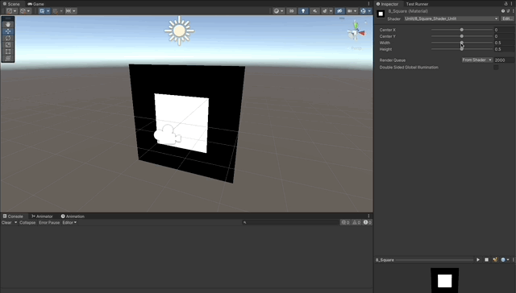
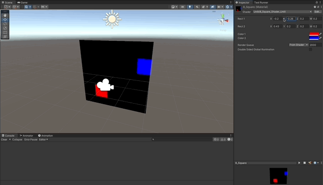
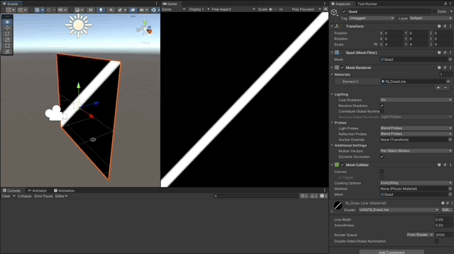
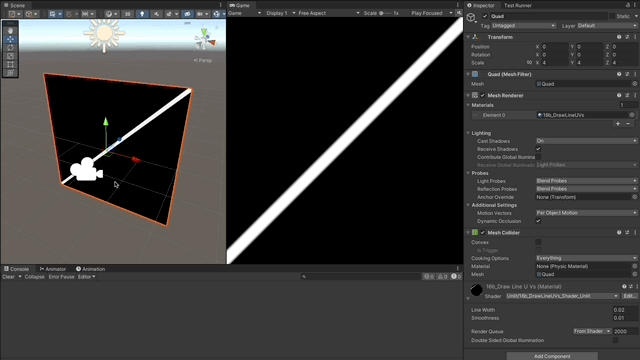
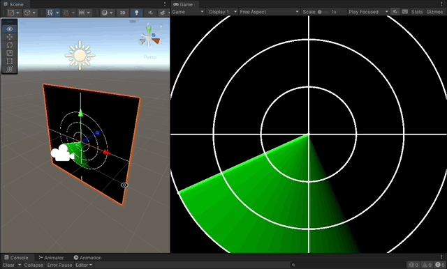
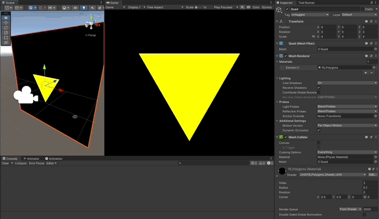

# Cg Shaping Shaders in Unity

A collection of Shaping Shaders written in **Cg** for the **Built-in RP** in Unity, from basic to advanced.

### References

[Learn Unity Shaders from Scratch - Nik Lever](https://www.udemy.com/course/learn-unity-shaders-from-scratch)

## Shaders

1. [Simple Red Unlit Shader](#simple-red-unlit-shader)
1. [Color Over Time](#color-over-time)
1. [With Exposed Properties in ShaderLab](#with-exposed-properties-in-shader-lab)
1. [Interpolated UVs](#interpolated-uvs)
1. [Custom Data from Vertex Shader](#custom-data-from-vertex-shader)
1. [Step](#step)
   1. [Smoothstep](#smoothstep)
1. [Circle](#circle)
1. [Square](#square)
   1. [Rectangle](#rectangle)
   1. [Rectangles](#rectangles)
1. [Follow Mouse](#follow-mouse)
1. [Moving Square](#moving-square)
1. [Rotating Square](#rotating-square)
   1. [Square Change Anchor](#square-change-anchor)
1. [Scaling Square](#scaling-square)
1. [Tiling](#tiling)
1. [Moved Circle](#moved-circle)
   1. [Soft Circle](#soft-circle)
1. [Outlined Circle](#outlined-circle)
1. [Draw Line](#draw-line)
   1. [Draw Line with UVs](#draw-line-with-uvs)
1. [Draw Sinusoidal](#draw-sinusoidal)
1. [Sonar Radar](#sonar-radar)
1. [Polygons](#polygons)

## Simple Red Unlit Shader

- Simplest `Cg` Shader code.
- No fog or any lighting calculation.
- No Properties in `ShaderLab`.
- Just one `SubShader` with one `Pass`.
- No override for the `Vertex Shader`.
- Simply returns a `fixed4(1,0,0,1)` for all pixels.

```c
fixed4 frag (v2f_img i) : SV_Target
{
    return fixed4(1,0,0,1);
}
```


## Color Over Time

- Same structure as the simple red unlit shader.
- Uses the [sin()](https://developer.download.nvidia.com/cg/sin.html) and [cos()](https://developer.download.nvidia.com/cg/cos.html) functions to oscillate the colors.
- Uses the `Unity` `uniform` variable [\_Time](https://docs.unity3d.com/Manual/SL-UnityShaderVariables.html), to change the color over time.

```c
fixed4 frag (v2f_img i) : SV_Target
{
    fixed redChannel = (sin(_Time.w) + 1) / 2;
    fixed blueChannel = (cos(_Time.w) + 1) / 2;

    fixed3 color = fixed3(redChannel, 0, blueChannel);

    return fixed4(color, 1); // oscillate between RED and BLUE

    // swizzling

    // return fixed4(color, 1).gbra; // oscillate between GREEN and BLUE
    // return fixed4(color, 1).rrra; // gray scale
    // return fixed4(color, 1).xxxw; // gray scale
}
```


## With Exposed Properties in ShaderLab

- Same structure as previous shaders.
- Exposes `_ColorA` and `_ColorB` to the Unity Editor, using `ShaderLab`.
- Uses the [lerp](https://developer.download.nvidia.com/cg/lerp.html) function to blend between the two colors.

```c
Properties
{
    _ColorA("Color A", Color) = (1,0,0,1)
    _ColorB("Color B", Color) = (0,0,1,1)
}
SubShader
{
    // subshader code

    Pass
    {
        CGPROGRAM
        // pass code

        fixed4 _ColorA;
        fixed4 _ColorB;

        fixed4 frag (v2f_img i) : SV_Target
        {
            float delta = (sin(_Time.w) + 1) / 2;
            fixed3 color = lerp(_ColorA, _ColorB, delta);

            return fixed4(color, 1);

            // return _ColorA; // just Color A
            // return _ColorA.grba; // swaps Red with Green
        }
        ENDCG
    }
}
```


## Interpolated UVs

- Same structure as previous shaders.
- Uses the `i.uv.x` interpolated value coming from the `v2f_img` struct from the `Vertex Shader` as the delta.

```c
fixed4 frag (v2f_img i) : SV_Target
{
    float delta = i.uv.x;
    fixed3 color = lerp(_ColorA, _ColorB, delta);

    return fixed4(color, 1.0);
}
```


## Custom Data from Vertex Shader

- Defines a custom `struct` called `v2f` for "vertex to fragment".
- Uses the `Cg` semantics accordingly.
- Defines a function for the `Vertex Shader`.
- **Paints the pixels** by [saturating](https://developer.download.nvidia.com/cg/saturate.html) the value of the interpolated for the pixel, on `Object Space`.
  - **Black** (0,0,0) in the left bottom, because object space coordinates there are (-0.5, -0.5) to (0,0), which after multiplying by 2 and then saturating, end up being (0,0,0)
  - **Green** (0,1,0) to **Yellow** (1,1,0) in the top, because object space coordinates there are (-0.5, 0.5) to (0.5, 0,5), which after multiplying by 2 and then saturating, end up being (0,1,0) to (1,1,0)
  - **Red** (1,0,0) to **Yellow** (1,1,0) in the right, because object space coordinates there are (0.5, -0.5) to (0.5, 0.5), which after multiplying by 2 and then saturating, end up being (1,0,0) to (1,1,0)

```c
struct v2f
{
    // Cg Semantics
    //      Binds Shader input/output to rendering hardware
    //      - SV_POSITION means system value position in DX10, corresponds to vertex position
    //      - TEXCOORDn means custom data

    float4 vertex: SV_POSITION; // From Object-Space to Clip-Space
    float4 position: TEXCOORD1;
    float4 uv: TEXCOORD0;
};

v2f vert (appdata_base v)
{
    v2f output;

    output.vertex = UnityObjectToClipPos(v.vertex);
    output.position = v.vertex;
    output.uv = v.texcoord;

    return output;
}

fixed4 frag (v2f i) : SV_Target
{
    // transforms values like this: (0.5, -0.5, 0.0) to (1, -1 , 0)
    fixed3 position = i.position * 2;

    // saturate clamps values to (0, 1)
    fixed3 color = saturate(position);

    return fixed4(color, 1.0);
}
```


## Step

- Same structure as previous shader.
- Uses [step](https://developer.download.nvidia.com/cg/step.html) to make the values be either 0 or 1, after passing the threshold, which is set to 0.

```c
fixed4 frag (v2f i) : SV_Target
{
    // transforms values like this: (0.5, -0.5, 0.0) to (1, -1 , 0)
    fixed3 color = i.position * 2;

    color.r = step(_StepEdge, color.r);
    color.g = step(_StepEdge, color.g);

    return fixed4(color, 1.0);
}
```


### Smoothstep

- Use [smoothstep](https://developer.download.nvidia.com/cg/smoothstep.html) to make the values be either 0 before first edge, or 1 after last edge, and an interpolation between 0 and 1 between edges.

```c
fixed4 frag (v2f i) : SV_Target
{
    // transforms values like this: (0.5, -0.5, 0.0) to (1, -1 , 0)
    fixed3 color = i.position * 2;

    color.r = smoothstep(_EdgeStart, _EdgeEnd, color.r);
    color.g = smoothstep(_EdgeStart, _EdgeEnd, color.g);

    return fixed4(color, 1.0);
}
```


## Circle

- Use [length](https://developer.download.nvidia.com/cg/length.html) to return a white pixel when the position of the pixel in object space is within the `_Radius`.
- [step](https://developer.download.nvidia.com/cg/step.html) to have 1 when outside the circle.
- Substract from 1 to invert the meaning, now 1 means inside the circle, multiply the final color by this.

```c
fixed4 frag (v2f i) : SV_Target
{
    fixed r = length(i.position.xy);
    fixed outCircle = step(_Radius, r);
    fixed inCircle = 1 - outCircle;

    return fixed4(1,1,1,1) * inCircle;
}
```


## Square

- Use `rect()` to return 1 only if the pixel is inside the square.

```c
float rect(float2 position, float2 center, float2 size)
{
    // returns 1 when the position is inside the rect defined by center and size
    float2 p = position - center;

    float2 halfSize = size * 0.5;

    // 0 if less than -halfSize, 1 if between -halfSize and halfSize, 0 if over halfSize
    float2 test = step(-halfSize, p) - step(halfSize, p);

    return test.x * test.y;
}

fixed4 frag (v2f i) : SV_Target
{
    float2 position = i.position.xy;
    fixed inRect = rect(position, float2(_CenterX, _CenterY), float2(_Width, _Height));

    return fixed4(1,1,1,1) * inRect;
}
```


### Rectangle



### Rectangles

```c
fixed4 frag (v2f i) : SV_Target
{
    float2 position = i.position.xy;
    fixed inRect1 = rect(position, _Rect1.xy, _Rect1.zw);
    fixed inRect2 = rect(position, _Rect2.xy, _Rect2.zw);

    return _Color1 * inRect1 + _Color2 * inRect2;
}
```



## Follow Mouse

- Use `rect()` but with a square based on the mouse position as center.
- Use a **C#** script to **RayCast** on top of the **Quad**, then **pass** the Mouse Position to the **Material**.

```cs
void Update()
{
    // Raycast
    RaycastHit hit;
    var ray = _camera.ScreenPointToRay(Input.mousePosition);

    if (Physics.Raycast(ray, out hit))
    {
        _mousePosition = hit.textureCoord;
    }

    _material.SetVector("_MousePosition", _mousePosition);
}
```

```c
fixed4 frag (v2f i) : SV_Target
{
    float2 position = i.uv;
    fixed inRect = rect(position, _MousePosition.xy, float2(0.1, 0.1));

    return fixed4(1,1,0,1) * inRect;
}
```


## Moving Square

- Use `rect()` but using `sin` and `cos` to position the rectangle.

```c
fixed4 frag (v2f i) : SV_Target
{
    float movementRadius = 0.3;

    // square measurements
    float2 center = float2(cos(_Time.w),sin(_Time.w)) * movementRadius;
    float2 size = 0.2;

    float2 position = i.position.xy * 2.0;

    fixed inRect = rect(position, center, size);

    return fixed4(1,1,0,1) * inRect;
}
```


## Rotating Square

- Use a 2D `rotation matrix` to rotate the pixel position.
- [Multiply the matrices and vectors](https://mathinsight.org/matrix_vector_multiplication) using [mul](https://developer.download.nvidia.com/cg/mul.html).

```c
float2x2 getRotationMatrix2D(float theta)
{
    float s = sin(theta);
    float c = cos(theta);

    return float2x2(c,-s,s,c);
}

fixed4 frag (v2f i) : SV_Target
{
    // rotation
    float2x2 rotation = getRotationMatrix2D(_Time.w);

    // square measurements
    float2 size = 0.5;

    float2 position = i.position.xy * 2.0;

    // reposition the pixel at the center, rotate around zero, then put back in place
    float2 rotatedPos = mul(rotation, position - _SquarePosition) + _SquarePosition;

    fixed inRect = rect(rotatedPos, _SquarePosition, size);

    return fixed4(1,1,0,1) * inRect;
}
```


### Square Change Anchor

```c
float rect(float2 position, float2 center, float2 size, float2 anchor = 0)
{
    // returns 1 when the position is inside the rect defined by center and size
    float2 p = position - center;

    float2 halfSize = size * 0.5;

    // 0 if less than -halfSize, 1 if between -halfSize and halfSize, 0 if over halfSize
    float2 test = step(-halfSize - anchor, p) - step(halfSize - anchor, p);

    return test.x * test.y;
}

```


## Scaling Square

- Use a 2D `scaling matrix` to scale the pixel position.
- Multiply the `rotation matrix` by the `scale matrix`, to generate a new `transform matrix`.

```c
float2x2 getScaleMatrix2D(float scale)
{
    return float2x2(scale,0,0,scale);
}

fixed4 frag (v2f i) : SV_Target
{
    // rotation and scaling
    float2x2 rotation = getRotationMatrix2D(_Time.w);
    float2x2 scale = getScaleMatrix2D((sin(_Time.w) + 1)/3 + 0.5);
    float2x2 transform = mul(rotation, scale);

    // square measurements
    float2 size = 0.3;

    float2 position = i.position.xy * 2.0;

    // reposition the pixel at the center, rotate around zero, then put back in place
    float2 rotatedPos = mul(transform, position - _SquarePosition) + _SquarePosition;

    fixed inRect = rect(rotatedPos, _SquarePosition, size, _SquareAnchor);

    return fixed4(1,1,0,1) * inRect;
}
```


## Tiling

- Use [frac](https://developer.download.nvidia.com/cg/frac.html) from **Cg** to extract the fractional component of the decimal values for UVs.
- This essentialy replicates many coordinate systems of `(0,0) to (1,1)` across the Quad.
- The calculations for the rotating square are still done in a `(0,0) to (1,1)` coordinate system.
- So, this basically clones the same thing we did before, but as many times as `Tile Count` states.
- `Tile Count` can have different values for `x` and `y`, distoring the tiles.

```c
fixed4 frag (v2f i) : SV_Target
{
    // rotation and scaling
    float2x2 rotation = getRotationMatrix2D(_Time.w);
    float2x2 scale = getScaleMatrix2D((sin(_Time.w) + 1)/3 + 0.5);
    float2x2 transform = mul(rotation, scale);

    // square measurements
    float2 size = 0.3;

    float2 position = frac(i.uv * _TileCount);

    // reposition the pixel at the center, rotate around zero, then put back in place
    float2 rotatedPos = mul(transform, position - _SquarePosition) + _SquarePosition;

    fixed inRect = rect(rotatedPos, _SquarePosition, size, _SquareAnchor);

    return fixed4(1,1,0,1) * inRect;
}
```


## Moved Circle

- Use a vector to set a position for the center of the circle, and calculate around it.

```c
float circle(float2 position, float2 center, float radius)
{
    // returns 1 if the point is inside the circle defined by center and radius

    fixed r = length(position - center);
    fixed outCircle = step(radius, r);
    fixed inCircle = 1 - outCircle;

    return inCircle;
}

fixed4 frag (v2f i) : SV_Target
{
    fixed inCircle = circle(i.position.xy, _CirclePosition, _CircleRadius);
    return fixed4(1,1,1,1) * inCircle;
}
```


### Soft Circle

- Use a `[Toggle]` property in `ShaderLab` to enable or disable the softness in the circle.
- Add a `smoothstep()` to the `circle()`

```c
float circle(float2 position, float2 center, float radius, bool soften = false)
{
    // returns 1 if the point is inside the circle defined by center and radius

    fixed r = length(position - center);

    float softenThreshold = soften ? radius * 0.2 : 0.0;

    fixed outCircle = smoothstep(radius - softenThreshold, radius + softenThreshold, r);
    fixed inCircle = 1 - outCircle;

    return inCircle;
}
```

```c
Properties
{
    // ...
    [Toggle] _Soften("Soften", Float) = 0
}
```

```c
fixed4 frag (v2f i) : SV_Target
{
    fixed inCircle = circle(i.position.xy, _CirclePosition, _CircleRadius, _Soften);
    return fixed4(1,1,1,1) * inCircle;
}
```


## Outlined Circle

- Use `step()` to check if the pixel is inside the circle outline.

```c
float circle(float2 position, float2 center, float radius, float lineWidth)
{
    // returns 1 if the point is inside the circle line width

    fixed r = length(position - center);

    fixed inCircle = step(radius - lineWidth, r) - step(radius + lineWidth, r);

    return inCircle;
}
```

```c
fixed4 frag (v2f i) : SV_Target
{
    fixed inCircle = circle(i.position.xy, _CirclePosition, _CircleRadius, _LineWidth);
    return fixed4(1,1,1,1) * inCircle;
}
```


## Draw Line

- Define a function to check if the uv coordinate is along the `x = y` line in the screen position.

```c
float onLine(float x, float y, float lineWidth, float edgeThickness)
{
    float halfLineWidth = lineWidth * 0.5;

    // returns 1 when (x,y) is in the line: x = y
    return smoothstep(
        x - halfLineWidth - edgeThickness,
        x - halfLineWidth,
        y
    ) - smoothstep(
        x + halfLineWidth,
        x + halfLineWidth + edgeThickness,
        y
    );
}
```

```c
fixed4 frag (v2f i) : SV_Target
{
    float2 uv = i.screenPos.xy / i.screenPos.w;

    float isOnLine = onLine(uv.x, uv.y, _Width, _Smoothness);

    return fixed4(1,1,1,1) * isOnLine;
}
```



### Draw Line with UVs

- Define a function to check if the uv coordinate is along the `x = y` line in the UVs coordinates in the texture.

```c
fixed4 frag (v2f i) : SV_Target
{
    float2 uv = i.uv;

    float isOnLine = onLine(uv.x, uv.y, _Width, _Smoothness);

    return fixed4(1,1,1,1) * isOnLine;
}
```



## Draw Sinusoidal

- Translate and scale the `sin()` function to make it be between (0, 0.5).
- Test each pixel to see if they match the `sin()` function, and turn them white.

```c
float getTransformedSin(float x){
    return ((sin(x) + 1.0) / 2.0) - 0.5;
}

fixed4 frag (v2f i) : SV_Target
{
    float2 position = i.position.xy * 2;

    // onLine checks that x = y, so, this will check that the sin() function is rendered
    float sinValue = getTransformedSin(position.x * UNITY_PI);
    float isOnLine = onLine(position.y, sinValue, _Width, _Smoothness);

    return fixed4(1,1,1,1) * isOnLine;
}
```


## Sonar Radar

- Draw the HUD of the Sonar using `onLine()` and `circle()`.
- **Sweep Line**
  - With `_Time`, `sin()` and `cos()`, draw an oscillating point that will set the direction of the radar sweeping line.
  - Use the [dot](https://developer.download.nvidia.com/cg/dot.html) function to [project each pixel over the line of the sweeping radar](https://mathinsight.org/dot_product), and get the scalar magnitude of the projection.
  - Get the actual closest point by using this scalar value and the guide point.
  - If the test pixel is close enough to the sweeping line, then draw it.
  - Clamp the sweeping line to be (0, radius).
- **Sweep Gradient**
  - Calculate the angle of the test pixel by using the [atan2](https://developer.download.nvidia.com/cg/atan2.html).
  - Calculate the angle from the test pixel to the sweep line.
  - Use [fmod](https://developer.download.nvidia.com/cg/fmod.html) to keep it between 0 and 2pi.
  - Calculate how much of the maximum gradient angle is used, then return this clamped value in (0,1).

```c
float sweepGradientTrail(float2 testPoint, float theta, float radius)
{
    if(length(testPoint) > radius){
        return 0;
    }

    const float sweepGradientTrailAngle = UNITY_PI * 0.5;

    float angleOfTestPoint = atan2(testPoint.y, testPoint.x);
    float angleToSweepLine = angleOfTestPoint + theta; // angles are counter clock-wise
    angleToSweepLine = fmod(angleToSweepLine + UNITY_TWO_PI , UNITY_TWO_PI); // modulo to 2pi

    // clamp angle so that it is not bigger than the gradientAngle
    float gradientAngleUsed = clamp(
        sweepGradientTrailAngle - angleToSweepLine,
        0.0,
        sweepGradientTrailAngle
    );

    return (gradientAngleUsed / sweepGradientTrailAngle) * 0.5;
}

float sweep(float2 position, float2 center, float radius, float lineWidth, float edgeThickness)
{
    // translate position to the coordinates system on the center
    float2 testPoint = position - center;

    // create an angle in radians from the time
    float theta = _Time.w;

    // point that defines the line of the sweep, from the center
    float2 guidePoint = float2(cos(theta), -sin(theta)) * radius;

    // length of the line when projecting the test point onto the guide point's line
    float projectedMagnitude = dot(testPoint, guidePoint) / dot(guidePoint, guidePoint);

    // clamp to maximum 1
    projectedMagnitude = clamp(projectedMagnitude, 0.0, 1.0);

    // get the projected point in the guide point's line
    float2 projectedPoint = guidePoint * projectedMagnitude;

    float distanceToSweepLine = length(testPoint - projectedPoint);

    // calculate gradient trail
    float gradientTrail = sweepGradientTrail(testPoint, theta, radius);

    return gradientTrail + 1.0 - smoothstep(lineWidth, lineWidth - edgeThickness, distanceToSweepLine);
}

fixed4 frag (v2f i) : SV_Target
{
    float2 position = i.uv;

    fixed4 lineColor = fixed4(1,1,1,1);

    // draw a crosshair
    float4 color = lineColor * onLine(position.x, 0.5, _Width, 0);
    color += lineColor * onLine(position.y, 0.5, _Width, 0);

    float2 center = 0.5;
    color += lineColor * circle(position, center, 0.3, _Width);
    color += lineColor * circle(position, center, 0.2, _Width);
    color += lineColor * circle(position, center, 0.1, _Width);
    color += fixed4(0,1,0,1) * sweep(position, center, 0.3, _Width, 0);

    return color;
}
```



## Polygons


